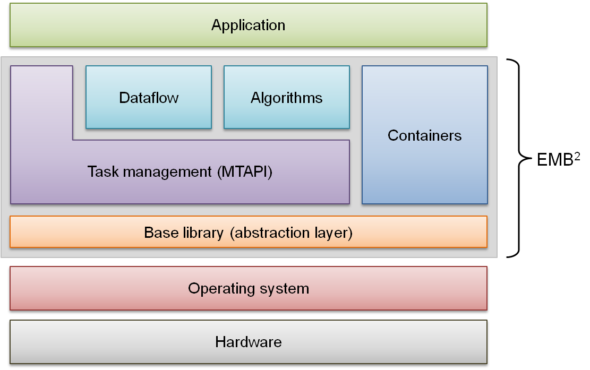
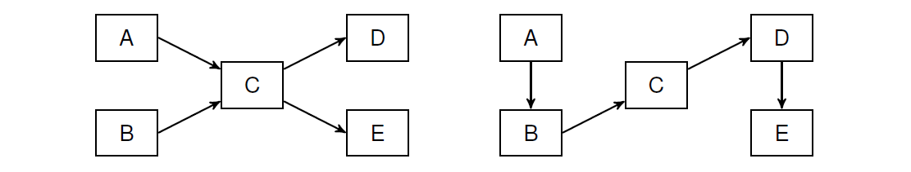
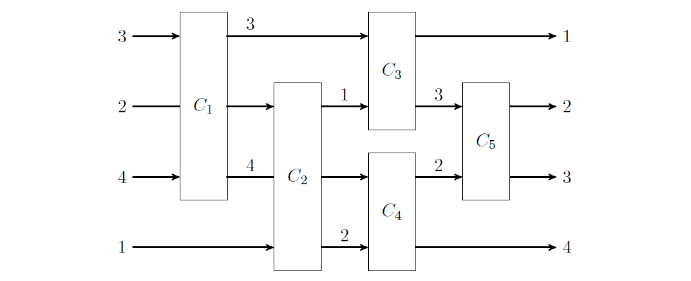

# Embedded Multicore Building Blocks (EMB²) Tutorial

## Contents

[**Introduction**](#cha_introduction)  
&nbsp;&nbsp;[Overview](#sec_introduction_overview)  
&nbsp;&nbsp;[Outline](#sec_introduction_outline)  
&nbsp;&nbsp;[Functions, Functors, and Lambdas](#sec_introduction_function_objects)  

[**MTAPI**](#cha_mtapi)  
&nbsp;&nbsp;[Foundations](#sec_mtapi_foundations)  
&nbsp;&nbsp;[C Interface](#sec_mtapi_c_interface)  
&nbsp;&nbsp;[C++ Interface](#sec_mtapi_cpp_interface)  
&nbsp;&nbsp;[Plugins](#sec_mtapi_plugins)  

[**Algorithms**](#cha_algorithms)  
&nbsp;&nbsp;[Function Invocation](#sec_algorithms_invoke)  
&nbsp;&nbsp;[Sorting](#sec_algorithms_sorting)  
&nbsp;&nbsp;[Counting](#sec_algorithms_counting)  
&nbsp;&nbsp;[Foreach Loops](#sec_algorithms_foreach)  
&nbsp;&nbsp;[Reductions](#sec_algorithms_reductions)  
&nbsp;&nbsp;[Prefix Computations](#sec_algorithms_prefix)  

[**Dataflow**](#cha_dataflow)  
&nbsp;&nbsp;[Linear Pipelines](#sec_dataflow_linear_pipelines)  
&nbsp;&nbsp;[Nonlinear Pipelines](#sec_dataflow_nonlinear_pipelines)  

[**Containers**](#cha_containers)  
&nbsp;&nbsp;[Object Pools](#sec_containers_object_pools)  
&nbsp;&nbsp;[Stacks](#sec_containers_stacks)  
&nbsp;&nbsp;[Queues](#sec_containers_queues)  

[**Bibliography**](#cha_bibliography)
  
## Introduction

### Overview

The Embedded Multicore Building Blocks (EMB²) are an easy to use yet powerful and efficient C/C++ library for the development of parallel applications. EMB² has been specifically designed for embedded systems and the typical requirements that accompany them, such as real-time capability and constraints on memory consumption. As a major advantage, low-level operations are hidden in the library which relieves software developers from the burden of thread management and synchronization. This not only improves productivity of parallel software development, but also results in increased reliability and performance of the applications.

EMB² is independent of the hardware architecture (x86, ARM, ...) and runs on various platforms, from small devices to large systems containing numerous processor cores. It builds on MTAPI, a standardized programming interface for leveraging task parallelism in embedded systems containing symmetric or asymmetric (heterogeneous) multicore processors. A core feature of MTAPI is low-overhead scheduling of fine-grained tasks among the available cores during runtime. Unlike existing libraries, EMB² supports task priorities and affinities, which allows the creation of soft real-time systems. Additionally, the scheduling strategy can be optimized for non-functional requirements such as minimal latency and fairness.

Besides the task scheduler, EMB² provides basic parallel algorithms, concurrent data structures, and skeletons for implementing stream processing applications (see [Figure 1](#fig_embb)). These building blocks are largely implemented in a non-blocking fashion, thus preventing frequently encountered pitfalls like lock contention, deadlocks, and priority inversion. As another advantage in real-time systems, the algorithms and data structures give certain progress guarantees. For example, wait-free data structures guarantee system-wide progress which means that every operation completes within a finite number of steps independently of any other concurrent operations on the same data structure.

**Figure 1**: Main Building Blocks of EMB²

### Outline

The purpose of this document is to introduce the basic concepts of EMB² and to demonstrate typical application scenarios by means of simple examples. The tutorial is not intended to be complete in the sense that it describes every feature of EMB². For a detailed description of the API, please see the reference manual.

In the next subsection, we briefly describe the concept of function objects which is essential for using . In Chapter [MTAPI](#cha_mtapi), we then present the task management features of MTAPI. These provide the basis for the algorithms outlined in Chapter [Algorithms](#cha_algorithms) and the dataflow framework presented in Chapter [Dataflow](#cha_dataflow).

### Functions, Functors, and Lambdas

Throughout this tutorial, we will encounter C++ types which model the C++ concept[1](#footnote_1) `FunctionObject`. The function object concept comprises function pointer, functor, and lambda types that are callable with suitable arguments by the function call syntax. Given a function object `f` and arguments `arg1`, `arg2`, `...`, the expression `f(arg1, arg2, ...)` is a valid function invocation. If you are already familiar with function objects, you can safely skip the rest of this section. Otherwise, it might be worth reading it to get an idea of what is meant when talking about a function objects.

Consider, for example, the transformation of an iterable range of data values. Specifically, consider a vector of integers initialized as follows: 

    \\\inputlistingsnippet{../examples/stl_for_each/stl_for_each.cc:setup}

The range consists of the values (`1, 2, 3, 4, 5`) and we now want to double each of them. We could simply get an iterator from the container holding the range, iterate over every element, and multiply it by two:

    \\\inputlistingsnippet{../examples/stl_for_each/stl_for_each.cc:manual}

The range then contains the values (`2, 4, 6, 8, 10`). In order to demonstrate the concept of function objects, we are now going to use the `std::for_each` function defined in the `algorithm` header of the C++ Standard Library. This function accepts as argument a `UnaryFunction`, that is, a function object which takes only one argument. In case of `std::for_each`, the argument has to have the same type as the elements in the range, as these are passed to the unary function. In our example, the unary function’s task is to double the incoming value. We could define a function for that purpose:

    \\\inputlistingsnippet{../examples/stl_for_each/stl_for_each.cc:function_define}

Since a function pointer models the concept of function objects, we can simply pass `&DoubleFunction` to `std::for_each`:

    \\\inputlistingsnippet{../examples/stl_for_each/stl_for_each.cc:function_run}

Another possibility is to define a functor

    \\\inputlistingsnippet{../examples/stl_for_each/stl_for_each.cc:functor_define}

and to pass an instance of this class to `std::for_each`:

    \\\inputlistingsnippet{../examples/stl_for_each/stl_for_each.cc:functor_run}

Functors as well as the function pointers separate the actual implementation from its place of usage which can be useful if the functionality is needed at different places. In many cases, however, it is advantageous to have the implementation of the function object at the same place as it is used. C++11 provides lambda expressions for that purpose which make our example more concise:

    \\\inputlistingsnippet{../examples/stl_for_each/stl_for_each.cc:lambda}

Of course, this example is too simple to really benefit from function objects and the algorithms contained in the C++ Standard Library. However, in combination with the parallelization features provided by EMB², function objects are a helpful mechanism to boost productivity. Within this document, whenever a function object or one of its subtypes is required, one can use a function pointer, a functor, or a lambda. For simplicity, we will restrict ourselves to lambdas in subsequent examples, as they are most suitable for this kind of tutorial.

_1 In this context, the term_ concept _refers to a named set of requirements on a type._

## MTAPI

Leveraging the power of multicore processors requires to split computations into fine-grained tasks that can be executed in parallel. Threads are usually too heavy-weight for that purpose, since context switches consume a significant amount of time. Moreover, programming with threads is complex and error-prone due to typical pitfalls such as race conditions and deadlocks. To solve these problems, efficient task scheduling techniques have been developed which dynamically distribute the available tasks among a fixed number of worker threads. To reduce overhead, there is usually exactly one worker thread for each processor core.

While task schedulers are nowadays widely employed, especially in desktop and server applications, they are typically limited to a single operating system running on a homogeneous multicore processor. System-wide task management in heterogeneous embedded systems must be realized explicitly with low-level communication mechanisms. MTAPI [[1]](#bib_mtapi) addresses those issues by providing an API which allows parallel embedded software to be designed in a straightforward way, covering homogeneous and heterogeneous multicore architectures, as well as acceleration units. It abstracts from the hardware details and lets software developers focus on the application. Moreover, MTAPI takes into account typical requirements of embedded systems such as real-time constraints and predictable memory consumption.

The remainder of this chapter is structured as follows: The next section explains the basic terms and concepts of MTAPI as given in the specification [[1]](#bib_mtapi). Section [MTAPI C Interface](#sec_mtapi_c_interface) describes the C API using a simple example taken from [[1]](#bib_mtapi). Finally, Section [MTAPI C++ Interface](#sec_mtapi_cpp_interface) outlines the use of MTAPI in C++ applications. Note that the C++ interface is provided by EMB² for convenience but it is not part of the standard.

### Foundations

#### Domains

An MTAPI system is composed of one or more MTAPI domains. An MTAPI domain is a unique system global entity. Each MTAPI domain comprises a set of MTAPI nodes. An MTAPI node may only belong to one MTAPI domain, while an MTAPI domain may contain one or more MTAPI nodes. This allows the programmer to use MTAPI domains as namespaces for all kinds of IDs (e.g., nodes, actions, queues, etc.).

#### Nodes

An MTAPI node is an independent unit of execution, such as a process, thread, thread pool, processor, hardware accelerator, or instance of an operating system. A given MTAPI implementation specifies what constitutes a node for that implementation.

The intent is to avoid a mixture of node definitions in the same implementation (or in different domains within an implementation). If a node is defined as a unit of execution with its private address space (like a process), then a core with a single unprotected address space OS is equivalent to a node, whereas a core with a virtual memory OS can host multiple nodes.

On a shared memory SMP processor, a node can be defined as a subset of cores. A quad-core processor, for example, could be divided into two nodes, one node representing three cores and one node representing the fourth core reserved exclusively for certain tasks. The definition of a node is flexible because this allows applications to be written in the most portable fashion supported by the underlying hardware, while at the same time supporting more general-purpose multicore and many-core devices.

The definition allows portability of software at the interface level (e.g., the functional interface between nodes). However, the software implementation of a particular node cannot (and often should not) necessarily be preserved across a multicore SoC product line (or across product lines from different silicon providers) because a given node’s functionality may be provided in different ways, depending on the chosen multicore SoC.

#### Tasks

A task represents the computation associated with the data to be processed. A task is executed concurrently to the code starting the task. The main API functions are `mtapi_task_start()` and `mtapi_task_wait()`. The semantics are similar to the corresponding thread functions (e.g. `pthread_create`/`pthread_join` in Pthreads). The lifetime of a task is limited; it can be started only once.

#### Actions

In order to cope with heterogeneous systems and computations implemented in hardware, a task is not directly associated with an entry function as it is done in other task-parallel APIs. Instead, it is associated with at least one action object representing the calculation. The association is indirect: one or more actions implement a job, one job is associated with a task. If the action is implemented in software, this is either a function on the same node (which can represent the same processor or core) or a function implemented on a different node that does not share memory with the core starting the task.

Starting a task consists of three steps:

1. Create the action object with a job ID (software-implemented actions only).
2. Obtain a job reference.
3. Start the task using the job reference.

#### Synchronization

The basic synchronization mechanism provided with in MTAPI is waiting for task completion. Calling `mtapi_task_wait()` with a task handle blocks the current thread or task until the task referenced by the handle has completed. Depending on the implementation, the calling thread can be used for executing other tasks while waiting for the task to be completed. In order to synchronize with a set of tasks, every task can be associated with a task group. The methods `mtapi_group_wait_all()` and `mtapi_group_wait_any()` wait for a group of tasks or completion of any task in the group, respectively.

#### Queues

Queues are used for guaranteeing sequential order of execution of tasks. A common use case is packet processing in the communication domain: for every connection all packets must be processed sequentially, while the packets of different connections can be processed in parallel to each other.

Sequential execution is accomplished by using a queue for every connection and queuing all packets of one connection into the same queue. In some systems, queues are implemented in hardware, otherwise MTAPI implements software queues. MTAPI is designed for handling thousands of queues that are processed in parallel.

The procedure for setting up and using a queue is as follows:

1. Create the action object (software-implemented actions only).
2. Obtain a job reference.
3. Create a queue object and attach the job to the queue
   (software-implemented queues only).
4. Obtain a queue handle if the queue was created on a different node,
   or if the queue is hardware-implemented.
5. Use the queue: enqueue the work using the queue.

Another important purpose of queues is that different queues can express different scheduling attributes for the same job. For example, in contrast to order-preserving queues, non-order-preserving queues can be used for load-balancing purposes between different computation nodes. In this case, the queue must be associated with more than one action implementing the same task on different nodes (i.e., different processors or cores implementing different instruction set architectures). If a queue is configured this way, the order will not be preserved.

#### Attributes

Attributes are provided as a means to extend the API. Different implementations may define and support additional attributes beyond those predefined by the API. To promote portability and implementation flexibility, attributes are maintained in an opaque data object that may not be directly examined by the user. Each object (e.g., task, action, queue) has an attributes data object associated with it, and many attributes have a small set of predefined values that must be supported by MTAPI implementations. The user may initialize, get, and set these attributes. For default behavior, it is not necessary to call the initialize, get, and set attribute functions. However, to get non-default behavior, the typical four-step process is:

1. Declare an attributes object of the `mtapi_<object>_attributes_t` data type.
2. `mtapi_<object>attr_init()`: Returns an attributes object with all
   attributes set to their default values.
3. `mtapi_<object>attr_set()`: (Repeat for all attributes to be set). Assigns a
   value to the specified attribute of the specified attributes object.
4. `mtapi_<object>_create()`: Passes the attributes object modified in the
   previous step as a parameter when creating the object.

At any time, the user can call `mtapi_<object>_get_attribute()` to query the value of an attribute. After an object has been created, some objects allow to change attributes by calling `mtapi_<object>_set_attribute()`.

### C Interface

The calculation of Fibonacci numbers is a simple example for a recursive algorithm that can easily be parallelized. [Listing 1](#lst_mtapi_fibonacci_sequential) shows a sequential version:

    int fib(int n) {
      int x,y;
      if (n < 2) {
        return n;
      } else {
        x = fib(n - 1);
        y = fib(n - 2);
        return x + y;
      }
    }

    int fibonacci(int n) {
      return fib(n);
    }

    void main(void) {
      int n = 6;
      int result = fibonacci(n);
      printf("fib(%i) = %i\n", n, result);
    }

**Listing 1**: Sequential program for computing Fibonacci numbers

This algorithm can be parallelized by spawning a task for one of the recursive calls (`fib(n - 1)`, for example). When doing this with MTAPI, an action function that represents `fib(int n)` is needed. It has the following signature:

    \\\inputlistingsnippet{../examples/mtapi/mtapi_c.cc:mtapi_c_action_signature}

Within the action function, the arguments should be checked, since the user might supply a buffer that is too small:

    \\\inputlistingsnippet{../examples/mtapi/mtapi_c.cc:mtapi_c_validate_arguments}

Here, `mtapi_context_status_set()` is used to report errors. The error code will be returned by `mtapi_task_wait()`. Also, care has to be taken when using the result buffer. The user might not want to use the result and supply a `NULL` pointer or accidentally a buffer that is too small:

    \\\inputlistingsnippet{../examples/mtapi/mtapi_c.cc:mtapi_c_validate_result_buffer}

At this point, calculation of the result can commence. First, the terminating condition of the recursion is checked:

    \\\inputlistingsnippet{../examples/mtapi/mtapi_c.cc:mtapi_c_terminating_condition}

After that, the first part of the computation is launched as a task using `mtapi_task_start()` (the action function is registered with the job `FIBONACCI_JOB` in the `fibonacci()` function and the resulting handle is stored in the global variable `mtapi_job_hndl_t fibonacciJob`):

    \\\inputlistingsnippet{../examples/mtapi/mtapi_c.cc:mtapi_c_calc_task}

The second part can be executed directly:

    \\\inputlistingsnippet{../examples/mtapi/mtapi_c.cc:mtapi_c_calc_direct}

Then, completion of the MTAPI task has to be waited for by calling `mtapi_task_wait()`:

    \\\inputlistingsnippet{../examples/mtapi/mtapi_c.cc:mtapi_c_wait_task}

Finally, the results can be added and written into the result buffer:

    \\\inputlistingsnippet{../examples/mtapi/mtapi_c.cc:mtapi_c_write_back}

The `fibonacci()` function gets a bit more complicated now. The MTAPI runtime has to be initialized first by (optionally) initializing node attributes and then calling `mtapi_initialize()`:

    \\\inputlistingsnippet{../examples/mtapi/mtapi_c.cc:mtapi_c_initialize}

Then, the action function needs to be associated to a job. By calling `mtapi_action_create()`, the action function is registered with the job `FIBONACCI_JOB`. The job handle of this job is stored in the global variable `mtapi_job_hndl_t fibonacciJob` so that it can be accessed by the action function later on:

    \\\inputlistingsnippet{../examples/mtapi/mtapi_c.cc:mtapi_c_register_action}

Now that the action is registered with a job, the root task can be started with `mtapi_task_start()`:

    \\\inputlistingsnippet{../examples/mtapi/mtapi_c.cc:mtapi_c_start_task}

After everything is done, the action is deleted (`mtapi_action_delete()`) and the runtime is shut down (`mtapi_finalize()`):

    \\\inputlistingsnippet{../examples/mtapi/mtapi_c.cc:mtapi_c_finalize}

### C++ Interface

provides C++ wrappers for the MTAPI C interface. The full interface provides functions for all MTAPI releated tasks and supports heterogeneous systems. For ease of use a simpler version for SMP systems is provided.

#### Full Interface

The signature of the action function for the C++ interface is the same as in the C interface:

    \\\inputlistingsnippet{../examples/mtapi/mtapi_cpp.cc:mtapi_cpp_action_signature}

Checking argument and result buffer sizes is the same as in the C example. Also, the terminating condition of the recursion still needs to be checked:

    \\\inputlistingsnippet{../examples/mtapi/mtapi_cpp.cc:mtapi_cpp_terminating_condition}

After that, the first part of the computation is launched as an MTAPI task using `embb::mtapi::Node::Start()` (the action function is registered with the job `FIBONACCI_JOB` in the `fibonacci()` function and the resulting handle is stored in the global variable `embb::mtapi::Job fibonacciJob`):

    \\\inputlistingsnippet{../examples/mtapi/mtapi_cpp.cc:mtapi_cpp_calc_task}

The second part can be executed directly:

    \\\inputlistingsnippet{../examples/mtapi/mtapi_cpp.cc:mtapi_cpp_calc_direct}

Then, completion of the MTAPI task has to be waited for using `embb::mtapi::Task::Wait()`:

    \\\inputlistingsnippet{../examples/mtapi/mtapi_cpp.cc:mtapi_cpp_wait_task}

Finally, the two parts can be added and written into the result buffer:

    \\\inputlistingsnippet{../examples/mtapi/mtapi_cpp.cc:mtapi_cpp_write_back}

Note that there is no need to do error checking everywhere, since errors are reported as exceptions. In this example there is only a single try/catch block in the main function:

    \\\inputlistingsnippet{../examples/mtapi/mtapi_cpp.cc:mtapi_cpp_main}

The `fibonacci()` function is about the same as in the C version. The MTAPI runtime needs to be initialized first:

    \\\inputlistingsnippet{../examples/mtapi/mtapi_cpp.cc:mtapi_cpp_initialize}

Then the node instance can to be fetched:

    \\\inputlistingsnippet{../examples/mtapi/mtapi_cpp.cc:mtapi_cpp_get_node}

After that, the action function needs to be associated to a job. By instancing an `embb::mtap::Action` object, the action function is registered with the job `FIBONACCI_JOB`. The job is stored in the global variable `embb::mtapi::Job fibonacciJob` so that it can be accessed by the action function later on:

    \\\inputlistingsnippet{../examples/mtapi/mtapi_cpp.cc:mtapi_cpp_register_action}

Now that the action is registered and the job is initialized, the root task can be started:

    \\\inputlistingsnippet{../examples/mtapi/mtapi_cpp.cc:mtapi_cpp_start_task}

Again, the started task has to be waited for (using `embb::mtapi::Task::Wait()`) before the result can be returned.

The registered action will be unregistered when it goes out of scope. The runtime needs to be shut down by calling:

    \\\inputlistingsnippet{../examples/mtapi/mtapi_cpp.cc:mtapi_cpp_finalize}

#### Simplified Interface for SMP actions

MTAPI CPP provides a simpler version of the MTAPI interface for SMP actions. The signature of the action function for the simplified API looks like this:

    void simpleActionFunction(
      TaskContext & task_context
    ) {
      // something useful
    } 

The action function does not need to be registered with a job. Instead a preregistered job is used that expects a `embb::base::Function<void, embb::mtapi::TaskContext &>` object. Therefore a task can be scheduled directly using only the function above:

    embb::mtapi::Task task = node.Start(simpleActionFunction); 

### Plugins

The implementation of MTAPI provides an extension to allow for custom actions that are not executed by the scheduler for software actions as detailed in the previous sections. Two plugins are delivered with , one for supporting distributed systems through TCP/IP networking and the other to allow for transparently using OpenCL accelerators.

#### Plugin API

The plugin API consists of a single function named `mtapi_ext_plugin_action_create()` contained in the mtapi\_ext.h header file. It is used to associate the plugin action with a specific job ID:

    mtapi_action_hndl_t mtapi_ext_plugin_action_create(
      MTAPI_IN mtapi_job_id_t job_id,
      MTAPI_IN mtapi_ext_plugin_task_start_function_t task_start_function,
      MTAPI_IN mtapi_ext_plugin_task_cancel_function_t task_cancel_function,
      MTAPI_IN mtapi_ext_plugin_action_finalize_function_t action_finalize_function,
      MTAPI_IN void* plugin_data,
      MTAPI_IN void* node_local_data,
      MTAPI_IN mtapi_size_t node_local_data_size,
      MTAPI_IN mtapi_action_attributes_t* attributes,
      MTAPI_OUT mtapi_status_t* status
    );

The plugin action is implemented through 3 callbacks, task start, task cancel and action finalize.

`task_start_function` is called when the user requests execution of the plugin action by calling `mtapi_task_start()` or `mtapi_task_enqueue()`. To those functions the fact that they operate on a plugin action is transparent, they only require the job handle of the job the action was registered with.

`task_cancel_function` is called when the user requests cancelation of a tasks by calling `mtapi_task_cancel()` or by calling `mtapi_queue_disable()` on a non-retaining queue.

`action_finalize_function` is called when the node is finalized and the action is deleted, or when the user explicitly deletes the action by calling `mtapi_action_delete()`.

For illustration our example plugin will provide a no-op action. The task start callback in that case looks like this:

    \\\inputlistingsnippet{../examples/mtapi/mtapi_c_plugin.cc:mtapi_c_plugin_task_start_cb}

The scheduling operation is responsible for bringing the task to execution, this might involve instructing some hardware to execute the task or pushing the task into a queue for execution by a separate worker thread. Here however, the task is executed directly:

    \\\inputlistingsnippet{../examples/mtapi/mtapi_c_plugin.cc:mtapi_c_plugin_task_schedule}

Since the task gets executed right away, it cannot be canceled and the task cancel callback implementation is empty:

    \\\inputlistingsnippet{../examples/mtapi/mtapi_c_plugin.cc:mtapi_c_plugin_task_cancel_cb}

The plugin action did not acquire any resources so the action finalize callback is empty as well:

    \\\inputlistingsnippet{../examples/mtapi/mtapi_c_plugin.cc:mtapi_c_plugin_action_finalize_cb}

Now that the callbacks are in place, the action can be registered with a job after the node was initialized using `mtapi_initialize()`:

    \\\inputlistingsnippet{../examples/mtapi/mtapi_c_plugin.cc:mtapi_c_plugin_action_create}

The job handle can now be obtained the normal MTAPI way. The fact that there is a plugin working behind the scenes is transparent by now:

    \\\inputlistingsnippet{../examples/mtapi/mtapi_c_plugin.cc:mtapi_c_plugin_get_job}

Using the job handle tasks can be started like normal MTAPI tasks:

    \\\inputlistingsnippet{../examples/mtapi/mtapi_c_plugin.cc:mtapi_c_plugin_task_do_start}

This call will lead to the invocation of then `plugin_task_start` callback function, where the plugin implementor is responsible for bringing the task to execution.

#### Network

The MTAPI network plugin provides a means to distribute tasks over a TCP/IP network. As an example the following vector addition action is used:

    \\\inputlistingsnippet{../examples/mtapi/mtapi_c_network.cc:mtapi_network_c_action_function}

It adds two float vectors and a float from node local data and writes the result into the result float vector. In the example code the vectors will hold `kElements` floats each.

To use the network plugin, its header file needs to be included first:

    \\\inputlistingsnippet{../examples/mtapi/mtapi_c_network.cc:mtapi_network_c_header}

After initializing the node using `mtapi_initialize()`, the plugin itself needs to be initialized:

    \\\inputlistingsnippet{../examples/mtapi/mtapi_c_network.cc:mtapi_network_c_plugin_initialize}

This will set up a listening socket on the localhost interface (127.0.0.1) at port 12345. The socket will allow a maximum of 5 connections and have a maximum transfer buffer size of `kElements * 4 * 3 + 32`. This buffer size needs to be big enough to fit at least the argument and result buffer sizes at once. The example uses 3 vectors of `kElements` floats using `kElements * sizeof(float) * 3` bytes.

Since the example connects to itself on localhost, the “remote” action needs to be registered with the `NETWORK_REMOTE_JOB`:

    \\\inputlistingsnippet{../examples/mtapi/mtapi_c_network.cc:mtapi_network_c_remote_action_create}

After that, the local network action is created, that maps `NETWORK_LOCAL_JOB` to `NETWORK_REMOTE_JOB` through the network:

    \\\inputlistingsnippet{../examples/mtapi/mtapi_c_network.cc:mtapi_network_c_local_action_create}

Now, `NETWORK_LOCAL_JOB` can be used to execute tasks by simply calling `mtapi_task_start()`. Their parameters will be transmitted through a socket connection and are consumed by the network plugin worker thread. The thread will start a task using the `NETWORK_REMOTE_JOB`. When this task is finished, the results will be collected and sent back through the network. Again the network plugin thread will receive the results, provide them to the `NETWORK_LOCAL_JOB` task and mark that task as finished.

When all work is done, the plugin needs to be finalized. This will stop the plugin worker thread and close the sockets:

    \\\inputlistingsnippet{../examples/mtapi/mtapi_c_network.cc:mtapi_network_c_plugin_finalize}

Then the node may be finalized by calling `mtapi_finalize()`.

#### OpenCL

The MTAPI OpenCL plugin allows the user to incorporate the computational power of an OpenCL accelerator, if one is available in the system.

The vector addition example from the network plugin is used again. However, the action function is an OpenCL kernel now:

    \\\inputlistingsnippet{../examples/mtapi/mtapi_c_opencl.cc:mtapi_opencl_c_kernel}

The OpenCL plugin header file needs to be included first:

    \\\inputlistingsnippet{../examples/mtapi/mtapi_c_opencl.cc:mtapi_opencl_c_header}

As with the network plugin, the OpenCL plugin needs to be initialized after the node has been initialized:

    \\\inputlistingsnippet{../examples/mtapi/mtapi_c_opencl.cc:mtapi_opencl_c_plugin_initialize}

Then the plugin action can be registered with the `OPENCL_JOB`:

    \\\inputlistingsnippet{../examples/mtapi/mtapi_c_opencl.cc:mtapi_opencl_c_action_create}

The kernel source and the name of the kernel to use (AddVector) need to be specified while creating the action. The kernel will be compiled using the OpenCL runtime and the provided node local data transferred to accelerator memory. The local work size is the number of threads that will share OpenCL local memory, in this case 32. The element size instructs the OpenCL plugin how many bytes a single element in the result buffer consumes, in this case 4, as a single result is a single float. The OpenCL plugin will launch `result_buffer_size/element_size` OpenCL threads to calculate the result.

Now the `OPENCL_JOB` can be used like a normal MTAPI job to start tasks.

After all work is done, the plugin needs to be finalized. This will free all memory on the accelerator and delete the corresponding OpenCL context:

    \\\inputlistingsnippet{../examples/mtapi/mtapi_c_opencl.cc:mtapi_opencl_c_plugin_finalize}

## Algorithms

The *Algorithms* building block of EMB² provides high-level constructs for typical parallelization tasks. They are aligned to the functions provided by the C++ Standard Library, but contain additional functionality typical for embedded systems such as task priorities. Although the algorithms can be used in a black-box way, it is good to have a basic understanding of their implementation: The algorithms split computations to be performed in parallel into tasks which are executed by the MTAPI task scheduler (cf. Chapter [MTAPI](#cha_mtapi)). For that purpose, the tasks are stored in queues and mapped to a fixed number of worker threads at runtime. Since MTAPI allocates the necessary data structures during initialization, the maximum number of tasks in flight is fixed. In case one of the algorithms exceeds this limit, an exception is thrown.

_**Note:** The_ Algorithms _building block is implemented using the MTAPI C++ interface. By calling `embb::mtapi::Node::Initialize` task and other limits can be customized. Explicit initialization also eliminates unexpected delays when measuring performance. See Section [MTAPI C++ Interface](#sec_mtapi_cpp_interface) for details._

In the following, we look at parallel function invocation
(Section [Function Invokation](#sec_algorithms_invoke)), sorting
(Section [Sorting](#sec_algorithms_sorting)), counting
(Section [Counting](#sec_algorithms_counting)), foreach loops
(Section [Foreach Loops](#sec_algorithms_foreach)), reductions
(Section [Reductions](#sec_algorithms_reductions)), and prefix computations
(Section [Prefix Computations](#sec_algorithms_prefix)).

### Function Invocation

Let us start with the parallel execution of several work packages encapsulated in functions. Suppose that the following functions operate on different data sets, and thus are independent of each other:

    \\\inputlistingsnippet{../examples/algorithms/invoke.cc:packages}

The functions can be executed in parallel using the `ParallelInvoke` construct provided by EMB²:

    \\\inputlistingsnippet{../examples/algorithms/invoke.cc:invokation}

Note that `ParallelInvoke` waits until all its arguments have finished execution.

Next, let us consider a more elaborate example. The following piece of code shows a serial quick sort algorithm which we want to parallelize (do not care about the details of the `Partition` function for the moment):

    \\\inputlistingsnippet{../examples/algorithms/invoke.cc:quick_sort}

A straightforward approach to parallelize this algorithm is to execute the recursive calls to `Quicksort` in parallel. With `ParallelInvoke` and lambdas, it is as simple as that:

    \\\inputlistingsnippet{../examples/algorithms/invoke.cc:parallel_quick_sort}

The lambdas capture the `first`, `mid`, and `last` pointers to the range to be sorted and forward them to the recursive calls of quick sort. These are executed in parallel, where `Invoke` does not return before both have finished execution. The above implementation of parallel quick sort is of course not yet optimal. In particular, the creation of new tasks should be stopped when a certain lower bound on the size of the subranges has been reached. The subranges can then be sorted sequentially in order to reduce the overhead for task creation and management. Fortunately, EMB² already provides solutions for parallel sorting, which will be covered in the following section.

### Sorting

For systems with constraints on memory consumption, the quick sort algorithm provided by is usually the best choice, since it works in-place which means that it does not require additional memory. Considering real-time systems, however, its worst-case runtime of _O(N2)_, where _N_ is the number of elements to be sorted, can be a problem. For this reason, EMB² also provides a parallel merge sort algorithm. Merge sort does not work in-place, but has a predictable runtime complexity of _ϴ(N log N)_. Assume we want to sort a vector of integers:

    \\\inputlistingsnippet{../examples/algorithms/sorting.cc:range_define}

Using quick sort, we simply write:

    \\\inputlistingsnippet{../examples/algorithms/sorting.cc:quick_sort}

The default invocation of `QuickSort` uses `std::less` with the iterators’ `value_type` as comparison operation. As a result, the range is sorted in ascending order. It is possible to provide a custom comparison operation, for example `std::greater`, by passing it as a function object to the algorithm. Sorting the elements in descending can be accomplished as follows:

    \\\inputlistingsnippet{../examples/algorithms/sorting.cc:custom_quick_sort}

The merge sort algorithm comes in two versions. The first version automatically allocates dynamic memory for temporary values when the algorithm is called. Its name is `MergeSortAllocate` and it has the same parameters as `QuickSort`. To enable the use of merge sort in environments that forbid dynamic memory allocation after initialization, the second version can be called with a pre-allocated temporary range of values:

    \\\inputlistingsnippet{../examples/algorithms/sorting.cc:merge_sort_preallocated}

The temporary range can be allocated at any time, e.g., during the initialization phase of the system.

### Counting

EMB² also provides functions for counting the number of elements in a range. Consider a range of integers from 0 to 3:

    \\\inputlistingsnippet{../examples/algorithms/counting.cc:setup}

To determine how often a specific value appears within the range, we could simply iterate over it and compare each element with the specified one. The `Count` function does this in parallel, where the first two arguments specify the range and the third one the element to be counted:

    \\\inputlistingsnippet{../examples/algorithms/counting.cc:count}

For the range given above, we have `count == 2`.

In case the comparison operation is not equality, we can employ the `CountIf` function. Here, the third argument is a unary predicate which evaluates to `true` for each element to be counted. The following example shows how to count the number of values greater than 0:

    \\\inputlistingsnippet{../examples/algorithms/counting.cc:if_count}

### Foreach Loops

A frequently encountered task in parallel programming is to apply some operation on a range of values, as illustrated in the example of Section [Function Objects](#sec_introduction_function_objects). In principle, one could apply the operation to all elements in parallel provided that there are no data dependencies. However, this results in unnecessary overhead if the number of elements is greater than the number of available processor cores _p_. A better solution is to partition the range into _p_ blocks and to process the elements of a block sequentially. With the `ForEach` construct provided by EMB², users do not have to care about the partitioning, since this is done automatically. Similar to the Standard Library’s `for_each` function, it is sufficient to pass the operation in form of a function object. The following piece of code shows how to implement the example of Section [Function Objects](#sec_introduction_function_objects) using EMB²:

    \\\inputlistingsnippet{../examples/algorithms/for_each.cc:doubling}

In the above code snippet, the results of the computation overwrite the input. If the input has to be left unchanged, the results must be written to a separate output range. Thus, the operation requires two ranges. EMB² supports such scenarios by the `ZipIterator`, which wraps two iterators into one. Consider the following revised example for doubling the elements of a vector:

    \\\inputlistingsnippet{../examples/algorithms/for_each.cc:zip_setup}

Using the `Zip` function as convenient way to create a zip iterator, the doubling can be performed as follows:

    \\\inputlistingsnippet{../examples/algorithms/for_each.cc:zip_doubling}

The argument to the lambda function is a `ZipPair` with the iterators’ reference value as template parameters. The elements pointed to by the zip iterator can be accessed via `First()` and `Second()`, similar to `std::pair`.

### Reductions

As mentioned in the previous section, the `ForEach` construct requires the loop iterations do be independent of each other. However, this is not always the case. Imagine we want to sum up the values of a range, e.g., a vector of integers:

    \\\inputlistingsnippet{../examples/algorithms/reduce.cc:range_init}

Sequentially, this can be done by a simple loop:

    \\\inputlistingsnippet{../examples/algorithms/reduce.cc:sequential}

One might be tempted to sum up the elements in parallel using a foreach loop. The problem is that parallel accesses to `sum` must be synchronized to avoid race conditions, which in fact sequentializes the loop. A more efficient approach is to compute intermediate sums for each block of the range and to sum them up at the end. For such purposes, EMB² provides the function `Reduce`:

    \\\inputlistingsnippet{../examples/algorithms/reduce.cc:parallel}

The third argument to `Reduce` is the neutral element of the reduction operation, i.e., the element that does not change the result. In case of addition (`std::plus`), the neutral element is 0. If we wanted to compute the product of the vector elements, the neutral element would be 1.

Next, let us consider the parallel computation of a dot product. Given two input ranges, we want to multiply each pair of input elements and sum up the products. The second input range is given as follows:

    \\\inputlistingsnippet{../examples/algorithms/reduce.cc:second_range_init}

The reduction consists of two steps: First, the input ranges are transformed and then, the reduction is performed on the transformed range. For that purpose, the `Reduce` function allows to specify a transformation function object. By default, this is the identity functor which does not modify the input range. To implement the dot product, we can use the `Zip` function (see Section [Foreach Loops](#sec_algorithms_foreach)) and a lambda function for computing the transformed range:

    \\\inputlistingsnippet{../examples/algorithms/reduce.cc:dot_product}

### Prefix Computations

Prefix computations (or scans) can be viewed as a generalization of reductions. They transform an input range _xi ϵ X_ into an output range _yi ϵ Y_ with _i=1,...,n_ such that

&nbsp;&nbsp;_y0 = id · x0_  
&nbsp;&nbsp;_y1 = y0 · x1_  
&nbsp;&nbsp;&nbsp;&nbsp;⁞  
&nbsp;&nbsp;_yi = yi-1 · xi_  
&nbsp;&nbsp;&nbsp;&nbsp;⁞  
&nbsp;&nbsp;_yn = yn-1 · xn_  

_id_ is the identity (neutral element) with respect to the operation _·: X_ x _X → Y_. As an example, consider the following range:

    \\\inputlistingsnippet{../examples/algorithms/scan.cc:setup}

Computing the prefix sums of `input_range` sequentially is easy:

    \\\inputlistingsnippet{../examples/algorithms/scan.cc:sequential_prefix_sum}

Note the dependency on loop iteration _i-1_ to compute the result in iteration _i_. A special two-pass algorithm is used in the function `Scan` to perform prefix computations in parallel. Using `Scan` to compute the prefix sums, we get:

    \\\inputlistingsnippet{../examples/algorithms/scan.cc:prefix_sum}

As in the case of reductions, the neutral element has to be given explicitly. Also, a transformation function can be passed as additional argument to `Scan`. The elements of the input range are then transformed before given to the prefix operation.

## Dataflow

With the *Dataflow* building block, EMB² provides generic skeletons for the development of parallel stream-based applications. These skeletons are based on dataflow process networks (DPNs), a model of computation which is, due to its simplicity and flexibility, widely employed in different domains like digital signal processing and imaging. As a major advantage, DPNs are deterministic which significantly simplifies testing and debugging. This is particularly important in safety-critical systems, where high demands are put on correctness and reliability. Moreover, DPNs are inherently parallel and hence, lend themselves well for execution on a multicore processor. In fact, they can be viewed as a generalization of pipelining, a frequently encountered parallel pattern.

_**Note:** The_ Dataflow _building block is implemented using the MTAPI C++ interface. Since MTAPI does not allocate memory after initialization, the number of tasks and other resources are limited. By calling `embb::mtapi::Node::Initialize` these limits can be customized. Explicit initialization also eliminates unexpected delays when measuring performance. See Section [MTAPI C++ Interface](sec_mtapi_cpp_interface) for details._

### Linear Pipelines

Before we go into detail, we demonstrate the basic concepts of this building block by means of a simple application which finds and replaces strings in a file. Let us start with the sequential implementation. The program shown in [Listing 2](#lst_replace_seq) reads a file line by line and replaces each occurrence of a given string with a new string.

    #include <iostream>
    #include <fstream>
    #include <string>
    #include <cstdlib>

    using namespace std;

    // replace all ocurrences of 'what' in 'str' with 'with'
    void repl(string& str, const string &what,
              const string& with) {
      string::size_type pos = 0;
      while((pos = str.find(what, pos)) != string::npos) {
        str.replace(pos, what.length(), with);
        pos += with.length();
      }
    }

    int main(int argc, char *argv[]) {
      // check and read command line arguments
      if(argc != 4) {
        cerr << "Usage: replace <what> <with> <file>" << endl;
        exit(EXIT_FAILURE);
      }
      const string what(argv[1]), with(argv[2]);

      // open input file
      ifstream file(argv[3]);
      if(!file) {
        cerr << "Cannot open file " << argv[3] << endl;
        exit(EXIT_FAILURE);
      }

      // read input file line by line and replace strings
      string str;
      while(getline(file, str)) {
        repl(str, what, with);
        cout << str << endl;
      }

      // close file and exit
      file.close();
      exit(EXIT_SUCCESS);
    }

**Listing 2**: Sequential program for replacing strings in a file

The main part consists of the `while` loop which performs three steps:

1. read a line from `file` and store it in the string `str`
2. replace each occurrence of `what` in `str` with `with`
3. write the resulting string to `cout`

To run this program on a multicore processor, we may execute the above steps in a pipelined fashion. In this way, a new line can be read from the hard disk while the previous one is still being processed. Likewise, processing a string and writing the result to standard output can be performed in parallel. Thus, the pipeline may consist of three stages as depicted in [Figure 2](#fig_replace_par).

**Figure 2**: Pipeline for replacing strings in a file

This pipeline can be easily implemented using the Dataflow building block. As the first step, we have to include the `dataflow.h` header file:

    \\\inputlistingsnippet{../examples/dataflow/dataflow_linear.cc:dataflow_include}

Then, we have to construct a *network*. A network consists of a set of processes that are connected by communication channels. EMB² provides a class `Network` that handles data routing and scheduling of your processes:

    \\\inputlistingsnippet{../examples/dataflow/dataflow_linear.cc:dataflow_network}

We need to prepare the network for the desired maximum number of elements that can be in the network at a time. The number of elements is limited to avoid that the network is flooded with new elements before the previous elements have been processed. In a linear pipeline, for example, this may happen if the source is faster than the sink. In our example, at most four elements may be processed simultaneously: one in the source, one in the sink, and two in the middle stage (see below). Finding an optimal value depends on the application and usually requires some experimentation. In general, large values boost the throughput but also increase the latency. Conversely, small values reduce the latency but may lead to a drop of performance in terms of throughput:

    \\\inputlistingsnippet{../examples/dataflow/dataflow_linear.cc:dataflow_make}

As the next step, we have to construct the processes shown in [Figure 2](#fig_replace_par). The easiest way to construct a process is to wrap the user-defined code in a lambda function and to pass it to the network. The network constructs an object for that process and executes the lambda function whenever new data is available. There are several methods for constructing processes depending on their type. The process **read** is a *source* process, since it produces data (by reading it from the specified file) but does not consume any data. Source processes are constructed from a function object

    \\\inputlistingsnippet{../examples/dataflow/dataflow_linear.cc:dataflow_source_function}

like this:

    \\\inputlistingsnippet{../examples/dataflow/dataflow_linear.cc:dataflow_declare_source}

Note the template argument `string` to `Source`. This tells that the process has exactly one *port* of type `string` and that this port is used to transmit data to other processes. The user-defined code can access the ports via the parameters of the function. Thus, each parameter corresponds to exactly one port. In our example, the result of the process is stored in a variable `str`, which is passed by reference. The replacement of the strings can be done by a *parallel* process, which means that multiple invocations of the process may be executed simultaneously. In general, processes that neither have any side effects nor maintain a state can safely be executed in parallel. This helps to avoid bottlenecks that arise when some processes are faster than others. Suppose, for example, that **replace** requires up to 50 ms to execute, whereas **read** and **write** each requires 10 ms to execute. If only one invocation of **replace** could be executed at a time, the throughput would be at most 20 elements per second. Since **replace** is a parallel process, however, the network may start a new invocation every 10 ms. Hence, up to five invocations may be executed in parallel, yielding a throughput of 100 elements per second. To compensate for variations in the runtime of parallel stages, may execute them *out-of-order*. As a result, the order in which the elements of a stream enter and leave parallel stages is not necessarily preserved. In our example, the runtime of **replace** may vary significantly due to the fact that not all lines have the same length and that the number of replacements depends on the content. However, let us now return to our example. The **replace** process is constructed from the function

    \\\inputlistingsnippet{../examples/dataflow/dataflow_linear.cc:dataflow_replace_function}

like this:

    \\\inputlistingsnippet{../examples/dataflow/dataflow_linear.cc:dataflow_declare_replace}

The template parameter `Network::Inputs<string>` specifies that the process has one port serving as input. Analogously, `Network::Outputs<string>` specifies that there is one port serving as output.

Since the last process (**write**) does not have any outputs, we make it a *Sink*. Unlike parallel processes, sinks are always executed *in-order*. takes care that the elements are automatically reordered according to their original order in the stream. In this way, the externally visible behavior is preserved even if some parallel stages may be executed out-of-order. The function

    \\\inputlistingsnippet{../examples/dataflow/dataflow_linear.cc:dataflow_sink_function}

is used to construct the sink:

    \\\inputlistingsnippet{../examples/dataflow/dataflow_linear.cc:dataflow_declare_sink}

_**Note:** If you parallelize your own application using EMB² and your compiler emits a lengthy error message containing lots of templates, it is very likely that for at least one process, the ports and their directions do not match the signature of the given function._

As the last step, we have to connect the processes (ports). This is straightforward using the C++ stream operator:

    \\\inputlistingsnippet{../examples/dataflow/dataflow_linear.cc:dataflow_connect}

Then we can start the network:

    \\\inputlistingsnippet{../examples/dataflow/dataflow_linear.cc:dataflow_run}

Note that you will probably not observe a speedup when you run this program on a multicore processor. One reason for this is that input/output operations like reading a file from the hard disk and writing the output to the screen are typically a bottleneck. Moreover, the amount of work done in the middle stage of the pipeline (**replace**) is rather low. To outweigh the overhead for parallel execution, the amount of work must be much higher. In image processing, for example, a single pipeline stage may process a complete image. To sum up, we haven chosen this example for its simplicity, not for its efficiency.

### Nonlinear Pipelines

Some applications exhibit a more complex structure than the linear pipeline presented in the previous section. Typical examples are applications where the result of a pipeline stage is used by more than one successor stage. Such pipelines are said to be nonlinear. In principle, every nonlinear pipeline can be transformed to a linear one as depicted in [Figure 3](#fig_linearization). However, this increases the latency and complicates the implementation due to data that must be passed through intermediate stages. In [Figure 3](#fig_linearization), for example, the data transferred from stage A to stage C must be passed through stage B in the linearized implementation.

**Figure 3**: Nonlinear pipeline and linearized variant

Nonlinear pipelines can be implemented as they are using , i.e., there is need not linearize them. As an example, let us consider the implementation of a sorting network. Sorting networks consist of a set of interconnected comparators and are used to sort sequences of data items. As depicted in [Figure 4](#fig_comparator), each comparator sorts a pair of values by putting the smaller value to one output, and the larger one to the other output. Thus, a comparator can be viewed as a switch that transfers the values at the inputs to the outputs, either directly or by swapping them (cf. [Figure 5](#fig_example_comparator)).

**Figure 4**: Block diagram of a comparator

**Figure 5**: Example for the operating principle of a comparator

[Figure 6](#fig_sorting_network) shows a sorting network with four inputs/outputs and five comparators. The numbers at the interconnections exemplify a “run” of the network. As can be seen from [Figure 6](#fig_sorting_network), the comparators _C1-C4_ “sink” the largest value to the bottom and “float” the smallest value to the top. The final comparator _C5_ simply sorts out the middle two values. In this way it is guaranteed that the values at the outputs occur in ascending order.

**Figure 6**: Sorting network with four inputs=outputs and five comparators

Let us now consider the implementation of the sorting network using EMB². As in the previous example, we need three types of processes: one or more sources that produce a stream of data items, a total number of five processes that implement the comparators, and one or more sinks that consume the sorted sequences. The processes should be generic so that they can be used with different types. For example, in one application we might use the network to sort integers, and in another application to sort floating point values.

The following Listing shows the implementation of the source processes using classes instead of functions.[2](#footnote_2)

    \\\inputlistingsnippet{../examples/dataflow/dataflow_nonlinear.cc:dataflow_producer}

The class-based approach has several advantages besides the use of templates: Firstly, the creation of multiple processes is straightforward. Secondly, one can derive other processes from a given base class such as `Producer`. Thirdly, it eases migration of existing code. For example, if you want to use an object of an existing class `foo` as a process, you might derive a class `bar` from `foo`. The function operator of `bar` then has access to the members provided by `foo`.

Each instance of the class `Network` maintains a list of source processes that belong to the network. You must explicitly add all sources to the network by a call to `AddSource`. For example, if we want to feed our sorting network `nw` with four streams of integer values, we may write:

    \\\inputlistingsnippet{../examples/dataflow/dataflow_nonlinear.cc:dataflow_declare_add_sources}

This is only necessary for source processes. All other processes are automatically found via a depth-first search starting from the source processes.

The code for the comparators looks like this:

    \\\inputlistingsnippet{../examples/dataflow/dataflow_nonlinear.cc:dataflow_comparator}

Since the comparators neither have any side effects nor maintain a state, we allow multiple invocations to be executed in parallel.

To check whether the resulting values are sorted, we use a single sink with four inputs:

    \\\inputlistingsnippet{../examples/dataflow/dataflow_nonlinear.cc:dataflow_consumer}

In general, however, we could also have a sink for each output of the sorting network. There is no restriction on the number of sources and sinks a network may have.

_2 For the sake of brevity, we omit the functionality. A complete
implementation can be found in the examples directory._

## Containers

Containers are essential for storing objects in an organized way. Unfortunately, the containers provided by the C++ Standard Library are not thread-safe. Attempts to read and write elements concurrently may corrupt the stored data. While such undefined behavior can be avoided by synchronizing all accesses using a mutex, this essentially eliminates any parallelism.

The containers provided by EMB² enable a high degree of parallelism by design. They are implemented in a lock-free or wait-free fashion, thus avoiding any blocking operations. This way, multiple threads or tasks may access a container concurrently without suffering from typical side effects like convoying. Wait-free algorithms even guarantee that an operation completes within a bounded number of steps. Consequently, threads are immune to starvation which is critical for real-time systems.

In embedded systems, memory is often preallocated in the initialization phase to minimize the effort for memory management during operation and to prevent unpredictable out-of-memory errors. EMB² containers have a fixed capacity and allocate the required memory at construction time. Consequently, they can be used in safety-critical application, where dynamic memory allocation after initialization is forbidden.

### Object Pools

An object pool allocates a fixed number of objects at construction. Objects can then be allocated from the pool and returned for later reuse. When implementing lock-free or wait-free algorithms, the underlying memory allocation scheme also to be lock-free or wait-free, respectively. However, memory allocation functions such as `new` and `delete` usually do not give any progress guarantees. To solve this problem, EMB² provides lock-free and wait-free object pools.

[Listing 3](#lst_object_pool_lst1) shows an example, where we create in line 1 an object pool with five objects of type `int`. If nothing else is specified, the object-pool uses a wait-free implementation. Then, we allocate five objects from the object pool and store the obtained pointers in a temporary array. The actual allocation takes place in line 6. After that, we deallocate them in the second loop be calling `FreeObject` on each pointer (see line 10).

    \\\inputlistingsnippet{../examples/containers/object_pool.cc:object_pool}

**Listing 3**: Object pool – initialization, allocation and deallocation

For actually allocating and deallocating objects, the object pool’s implementation relies on a value pool which keeps track of the objects in use. If the value pool is implemented in a lock-free manner, the object pool is lock-free as well (analogously for wait-free pools). Currently, EMB² provides two value pools: `WaitFreeArrayValuePool` and `LockFreeTreeValuePool`. Normally (if nothing is specified), the wait-free pool is used. For having a lock-free object pool instead, one has to specify the corresponding value pool to use as additional template parameter. If we replace line 1 of the previous example with the following lines, the object pool is not wait-free anymore but lock-free (the values are of type `int` and initialized to `0`):

    \\\inputlistingsnippet{../examples/containers/object_pool.cc:object_pool_2}

This will result in a speed-up for most applications, but progress guarantees are weaker.

### Stacks

As the name indicates, the class template `LockFreeStack` implements a lock-free stack which stores elements according to the LIFO (Last-In, First-Out) principle. [Listing 4](#lst_stack_lst1) shows a simple example. In line 1, we create a stack of integers with a capacity of 10 elements.[3](#footnote_3) The stack provides two methods, `TryPush` and `TryPop`, both returning a Boolean value indicating success of the operation: `TryPop` returns `false` if the stack is empty, and `TryPush` returns false if the stack is full. `TryPop` returns the element removed from the stack via reference.

    \\\inputlistingsnippet{../examples/containers/stack.cc:stack}

**Listing 4**: Stack - initialization, push and pop

In line 4 of [Listing 4](#lst_stack_lst1), we try to pop an element from the empty stack, which has to fail. In the for-loop in line 7, we fill the stack with `int` values 0 ... 4. Afterwards, in the loop in line 12, we pop five values (line 13) from the stack into variable `j`. According to the LIFO semantics, the values are popped in reverse order, i.e., we get the sequence 4 ... 0. This is checked by the assertion in line 14.

_3 Due to the necessary over-provisioning of memory in thread-safe memory management, the stack might be able to hold more than 10 elements, but is guaranteed to be able to hold at least 10 elements._

### Queues

There are two FIFO (First-In, First-Out) queue implementations in , `LockFreeMPMCQueue` and `WaitFreeSPSCQueue`. The former permits multiple producers and multiple consumers (MPMC), whereas the latter is restricted to a single producer and a single consumer (SPSC). The interfaces are the same for both queues.

[Listing 5](#lst_queue_lst1) shows an example for the `LockFreeMPMCQueue`. In line 1, we create a queue with element type `int` and a capacity of 10 elements.[4](#footnote_4) The Boolean return value of the methods `TryEnqueue` and `TryDequeue` indicates success (`false` if the queue is full or empty, respectively).

    \\\inputlistingsnippet{../examples/containers/queues.cc:queue}

**Listing 5**: Queue – initialization, enqueue and dequeue

In line 4 of [Listing 5](#lst_queue_lst1), we try to dequeue an element from the empty queue, which has to fail. In the for-loop in line 7, we fill the queue with `int` values 0 ... 4. Afterwards, in the loop in line 12, we dequeue five values (line 13) from the queue into variable `j`. According to the FIFO semantics, the values are dequeued in the same order as they were enqueued, i.e., we get the sequence 0 ... 4. This is checked by the assertion in line 14.

_4 As in case of stacks, the queue may actually hold more than 10 elements._

## Bibliography

[1] _Multicore Task Management API (MTAPI) Specification V1.0_, The Multicore Association, Mar. 2013.